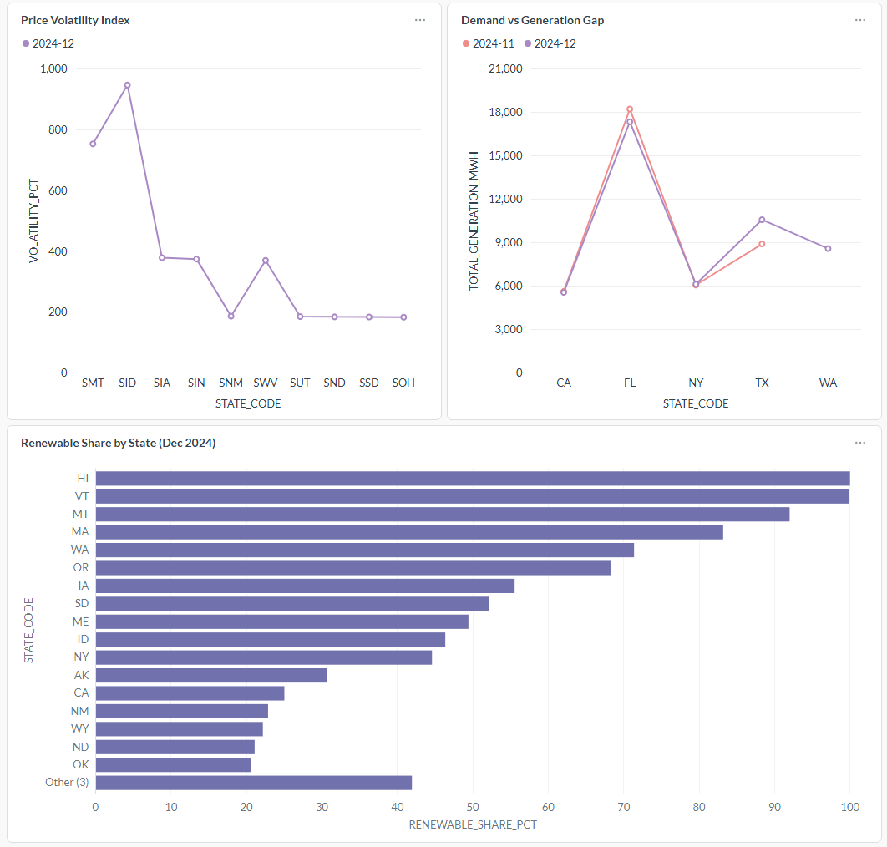
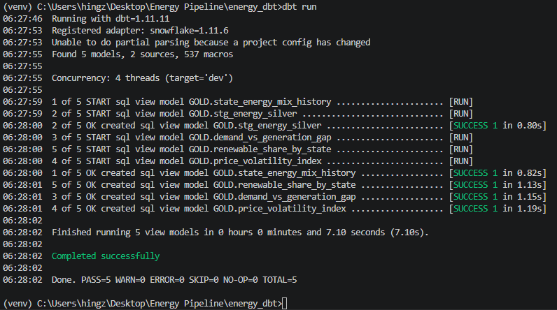
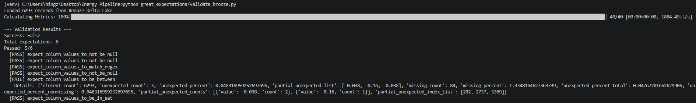
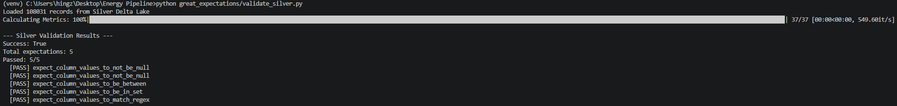
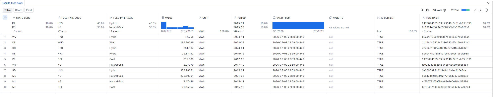

# EIA Energy Pipeline

End-to-end data engineering pipeline tracking US energy production, consumption, and pricing across electricity, natural gas, and renewables by region (2020-2024).

## Architecture

*(Architecture diagram placeholder)*

## Tech Stack

| Layer | Technology |
|---|---|
| Ingestion | Python, EIA Open Data API |
| Streaming | Apache Kafka (KRaft mode) |
| Lake Storage | Delta Lake (partitioned by source + period) |
| LLM Enrichment | Groq (Llama3) – trend narrative generation |
| Warehouse | Snowflake (XSMALL, auto-suspend) |
| Data Modeling | dbt Core + dbt-snowflake |
| Data Quality | Great Expectations 1.18 |
| Orchestration | Docker Compose |
| Dashboard | Metabase |

## Pipeline Layers

### Bronze (Raw)
- Raw EIA data landed as-is from the API
- 6,293 records across electricity generation, natural gas prices, and renewable generation
- Partitioned by `source` and `period`
- Great Expectations enforces 6 schema contracts on ingestion – intentionally catches 3 negative value anomalies in raw EIA feed

### Silver (Cleaned + Enriched)
- 87 records dropped (nulls, negatives)
- 6,206 clean records
- Fuel type and state code normalization (`COL` → `Coal`, `CA` → `California`)
- LLM enrichment: Groq generates plain-English trend summaries for sampled records
- Great Expectations enforces 5 contracts – all pass, confirming cleaning logic works

### Gold (Snowflake + dbt)
Four dbt mart models:
- `renewable_share_by_state` – % renewable vs fossil by state and period
- `price_volatility_index` – rolling stddev of natural gas prices by region
- `demand_vs_generation_gap` – total vs renewable generation by state
- `state_energy_mix_history` – exposes SCD Type 2 dimension table

## Snowflake Features Used
- **Key-pair authentication** – RSA-based auth for programmatic access
- **SCD Type 2** – `MERGE` statement tracks state energy mix changes over time with `valid_from`, `valid_to`, `is_current`, and `row_hash` fingerprinting
- **Streams + Tasks** – Snowflake Stream watches `energy_silver` for new data, Task runs SCD merge automatically on hourly CRON schedule
- **RBAC** – read-only `energy_analyst_readonly` role scoped to gold schema only
- **Resource Monitor** – 20-credit cap with 75% notification threshold

## Data Quality

| Layer | Expectations | Result |
|---|---|---|
| Bronze | 6 | 5/6 pass – 3 negative values caught (raw EIA anomalies, expected) |
| Silver | 5 | 5/5 pass – confirms cleaning logic removes all anomalies |

## Dashboard
Metabase connected to Snowflake gold layer via key-pair auth.



## Screenshots

### dbt Run


### Bronze Validation (intentional fail)


### Silver Validation (all pass)


### Snowflake SCD Table


## Setup

### Prerequisites
- Python 3.10+
- Docker Desktop
- Snowflake account
- EIA API key (free at eia.gov/opendata)
- Groq API key (free at console.groq.com)

### Run

```bash
# 1. Clone and setup
git clone [https://github.com/LeonDes7/eia-energy-pipeline](https://github.com/LeonDes7/eia-energy-pipeline)
cd eia-energy-pipeline
python -m venv venv
source venv/bin/activate  # On Windows use: venv\Scripts\activate
pip install -r requirements.txt

# 2. Configure environment
cp .env.example .env
# Fill in EIA_API_KEY, GROQ_API_KEY, SNOWFLAKE_ACCOUNT, SNOWFLAKE_USER

# 3. Start Kafka
docker-compose up -d

# 4. Run pipeline
python ingestion/fetch_energy.py
python kafka/producer.py
python kafka/consumer.py
python silver/transform.py
python snowflake/load_silver.py

# 5. Run dbt
cd energy_dbt
dbt run

# 6. Validate data quality
cd ..
python great_expectations/validate_bronze.py
python great_expectations/validate_silver.py

# Project Structure
eia-energy-pipeline/
├── ingestion/
│   └── fetch_energy.py          # EIA API ingestion (3 series)
├── kafka/
│   ├── producer.py              # Publishes records to Kafka topic
│   └── consumer.py              # Consumes and writes to Bronze Delta Lake
├── silver/
│   └── transform.py             # Cleaning + LLM enrichment
├── snowflake/
│   └── load_silver.py           # Loads Silver to Snowflake via key-pair auth
├── energy_dbt/
│   └── models/
│       ├── staging/             # Source definitions + staging view
│       └── gold/                # 4 mart models
├── great_expectations/
│   ├── validate_bronze.py       # 6 contracts on raw data
│   └── validate_silver.py       # 5 contracts on cleaned data
├── data/
│   ├── bronze/                  # Delta Lake bronze layer
│   └── silver/                  # Delta Lake silver layer
└── docker-compose.yml           # Kafka + Metabase